# 🚀 Hackathon Guide: Advertisement Detection and Geolocation with Panoramax

This technical guide is designed for a **hackathon** team. It is based on the official Panoramax workflow and covers everything from extracting known locations using OpenStreetMap, obtaining images from Panoramax, manual and auto-labeling with Label Studio, to training a custom YOLOv8 model to detect **advertisements (billboards, posterboxes, banners, totems)**. Finally, it addresses the geolocation of the detections.

---

## 📋 Table of Contents

1. [The Workflow (Pipeline)](#1-the-workflow-pipeline)
2. [Phase 1: Finding locations and downloading images](#2-phase-1-finding-locations-and-downloading-images)
3. [Phase 2: Image labeling with Label Studio](#3-phase-2-image-labeling-with-label-studio)
4. [Phase 3: Model training with YOLOv8](#4-phase-3-model-training-with-yolov8)
5. [Phase 4: Mass prediction and refinement](#5-phase-4-mass-prediction-and-refinement)
6. [Phase 5: Geolocation: From pixel to GPS coordinate](#6-phase-5-geolocation-from-pixel-to-gps-coordinate)
7. [Differentiating factors to win the Hackathon](#7-differentiating-factors-to-win-the-hackathon)

---

## 1. The Workflow (Pipeline)

The main strategy for this hackathon exercise adopts the official tools from the Panoramax detection tutorial:

```mermaid
flowchart LR
    A[OpenStreetMap] -->|Real ad locations| B[Panoramax API]
    B -->|Image download| C[YOLO-World]
    C -->|Automatic pre-annotations| D[Label Studio]
    D -->|Correction and export| E[YOLOv8 Training]
    E -->|Validated model| F[Mass Prediction]
    F -->|GPS trigonometric calculation| G[GeoJSON / Map]
```



**Environment Requirements:**
Install the necessary dependencies in your virtual environment:
```bash
pip install torch torchvision ultralytics label-studio requests shapely opencv-python
```

---

## 2. Phase 1: Finding locations and downloading images

To train our model, we need photos where we know outdoor advertising furniture appears.

### 2.1 Find locations in OpenStreetMap with Overpass Turbo
In **OpenStreetMap** (OSM), billboards are mapped under the `advertising` tag.
Go to [Overpass Turbo](https://overpass-turbo.eu/) and use the "Wizard" with the search:
`"advertising" in [Your City]`
Alternatively, run this query to get the precise locations:
```text
node["advertising"]({{bbox}});
out center;
```
Export the data by downloading it in **GeoJSON** format.

### 2.2 Download images from Panoramax
We will use the **Panoramax API** (`https://api.panoramax.xyz/api/search`) to ask for photos taken in the vicinity of the ads found in OSM.
* Search tip: Use the parameters `place_distance=2-10` and `place_position=lon,lat` extracted from your GeoJSON.
* Create a Python script (e.g., `find_pics.py`) that iterates your GeoJSON and saves about 100 or 200 photos focusing on those coordinates to your computer.

---

## 3. Phase 2: Image labeling with Label Studio

[Label Studio](https://labelstud.io/) is the recommended open-source tool for preparing and reviewing your training *dataset*.

### 3.1 Automatic Pre-labeling (💡 Time-saving hack)
Labeling hundreds of photos manually in a hackathon takes too much time. It is recommended to automate this using a **Zero-Shot model** (like YOLO-World) to pre-draw the boxes:
1. Pass your images through a script using `YOLO-World` searching for classes like `["billboard", "advertising board", "bus stop ad"]`.
2. Export the result of those detections to the format accepted by Label Studio.
3. Import these pre-annotations along with your photos. Thus, the hackathon team will only dedicate itself to **correcting** and refining the AI boxes, which is much faster than drawing from scratch.

### 3.2 Label Studio Process
1. **Start Label Studio**: Run the `label-studio` command in your terminal (`http://localhost:8080`).
2. **Create Project**: Create a project called "Advertisements".
3. **Configure Template**: Go to *Labelling setup* > *Computer vision* > *Object detection with bounding boxes*.
4. **Define Classes**: Add the types of ads you are going to label: `billboard`, `posterbox`, `totem`.
5. **Import and Refine**: Upload your images and the generated pre-annotations. Review each photo, adjust inaccurate boxes, and delete false positives.
6. **Export Dataset**: Use the *Export* button and choose the **YOLO** format to download a ZIP.

### 3.3 Split into Training and Validation
When unzipping the exported ZIP, divide the dataset to measure the accuracy of the model:
- **Training**: Extract 80% of your images and their corresponding `.txt` label files to a folder `ads_data_v1/images` and `ads_data_v1/labels`.
- **Validation**: Extract the remaining 20% to folders `ads_data_val/images` and `ads_data_val/labels`.

---

## 4. Phase 3: Model training with YOLOv8

Create a configuration file in the root of your project, called `data.yaml`. This file will guide YOLO to your dataset:

```yaml
train: /absolute/path/to/ads_data_v1/images
val: /absolute/path/to/ads_data_val/images
nc: 3
names: ['billboard', 'posterbox', 'totem']
```

**Launch the training**:
With an available GPU or even with a CPU, execute the following command in the terminal using the lightest base model (`yolov8n.pt`):

```bash
yolo detect train data=data.yaml model=yolov8n.pt project=ads_model_v1 epochs=100 imgsz=2048 batch=-1
```
*(Note on size: `imgsz=2048` respects the standard Panoramax resolution. If you lack memory or it takes too long, reduce it to `1024` or `640`).*

When finished, your custom model will be saved in `ads_model_v1/train/weights/best.pt`.

---

## 5. Phase 4: Mass prediction and refinement

### 5.1 Prediction (Inference)
You can test your model on a single photo to check that it works:
```bash
yolo predict project=ads_model_v1 model=ads_model_v1/train/weights/best.pt source=test.jpg imgsz=2048 save_txt=True
```

### 5.2 Refinement (Mitigate False Positives)
In a first iteration, it is normal for Artificial Intelligence to confuse, for example, large glass windows or rectangular traffic signs with billboards (False Positives).
1. If you prepare a mass script (`predict_pano.py`) and review the results and see these failures, go back to **Label Studio**.
2. **Create new classes** or labels (e.g., `window`, `traffic_sign`).
3. Upload photos that have failed, add annotations to teach what is an ad and what is *something else*.
4. Export, divide, and **retrain a new model** (`ads_model_v2`).
5. Study the *Normalized Confusion Matrix* graph (`confusion_matrix_normalized.png`) generated in the training folder to mathematically verify if you are reducing false positives.

---

## 6. Phase 5: Geolocation: From pixel to GPS coordinate

If your project calculates and extracts the coordinates of the detected ad to the real world, it becomes a product of the highest technical level for the jury.

Every image extracted from Panoramax has STAC metadata:
- `geometry`: Camera coordinates (`lat`, `lon`).
- `view:azimuth` or `exif:GPSImgDirection`: Camera heading in degrees (0 to 360).

**Basic trigonometric algorithm**:
1. The bounding box indicates on which side of the image the ad is. For an MVP, assume the camera points towards the center and the ad aligns with the photo.
2. Estimate the real distance `d` in meters. In urban advertising (posterboxes), the detected elements are usually ~7 meters away from the cars/cameras mapping the streets.
3. Mathematically project the real position from the car's location to the sidewalk:
   $$\text{Lat}_{ad} = \text{Lat}_{cam} + \frac{d \cdot \cos(\text{Heading})}{111111}$$
   $$\text{Lon}_{ad} = \text{Lon}_{cam} + \frac{d \cdot \sin(\text{Heading})}{111111 \cdot \cos(\text{Lat}_{cam})}$$
   *(Make sure to convert your `Heading` or azimuth to radians using Python's `math` library).*

Map all these generated detections to a standardized file like `detected_ads.geojson`.

---

## 7. Differentiating factors to win the Hackathon

1. **The Data Lifecycle**: Showing in your presentation the rigorous use of the entire ecosystem (Overpass Turbo ➔ Panoramax API ➔ YOLO-World ➔ Label Studio ➔ YOLOv8 ➔ GeoJSON) demonstrates engineering excellence.
2. **OCR Reading and Brands**: Crop the detected ad and pass it through `easyocr` or `tesseract`. Detecting locations is excellent, but automatically tabulating advertising brands ("On this street there is a Samsung ad") is a revolutionary business case.
3. **Interactive Viewer / Dashboard**: Mount a web viewer that reads your `detected_ads.geojson` using **Leaflet**, **MapLibre GL**, or the Python library **Streamlit**, allowing the model in action to be visualized on a map.
4. **Regulatory Validation**: Some municipalities prohibit illuminated ads near schools or historical areas. You can download "schools" polygons using OpenStreetMap/Overpass Turbo and make a geographical intersection with the ads to raise "illegal advertising alerts".
