# 🚀 Guide du Hackathon : Détection et Géolocalisation de Publicités avec Panoramax

Ce guide technique est conçu pour une équipe de **hackathon**. Il est basé sur le flux de travail officiel de Panoramax et couvre l'extraction d'emplacements connus à l'aide d'OpenStreetMap, l'obtention d'images dans Panoramax, l'étiquetage manuel et automatique avec Label Studio, jusqu'à la formation d'un modèle YOLOv8 personnalisé pour détecter des **publicités (panneaux publicitaires, mupis, abribus, totems)**. Enfin, il aborde la géolocalisation des détections.

---

## 📋 Sommaire

1. [Le Flux de Travail (Pipeline)](#1-le-flux-de-travail-pipeline)
2. [Phase 1 : Trouver des emplacements et télécharger des images](#2-phase-1-trouver-des-emplacements-et-télécharger-des-images)
3. [Phase 2 : Étiquetage d'images avec Label Studio](#3-phase-2-étiquetage-dimages-avec-label-studio)
4. [Phase 3 : Entraînement du modèle avec YOLOv8](#4-phase-3-entraînement-du-modèle-avec-yolov8)
5. [Phase 4 : Prédiction de masse et raffinement](#5-phase-4-prédiction-de-masse-et-raffinement)
6. [Phase 5 : Géolocalisation : Du pixel à la coordonnée GPS](#6-phase-5-géolocalisation-du-pixel-à-la-coordonnée-gps)
7. [Facteurs différenciateurs pour gagner le Hackathon](#7-facteurs-différenciateurs-pour-gagner-le-hackathon)

---

## 1. Le Flux de Travail (Pipeline)

La stratégie principale pour cet exercice de hackathon adopte les outils officiels du tutoriel de détection Panoramax :

```mermaid
flowchart LR
    A[OpenStreetMap] -->|Emplacements réels de pubs| B[API Panoramax]
    B -->|Téléchargement d'images| C[YOLO-World]
    C -->|Pré-annotations automatiques| D[Label Studio]
    D -->|Correction et exportation| E[Entraînement YOLOv8]
    E -->|Modèle validé| F[Prédiction de Masse]
    F -->|Calcul trigonométrique GPS| G[GeoJSON / Carte]
```



**Exigences de l'environnement :**
Installez les dépendances nécessaires dans votre environnement virtuel :
```bash
pip install torch torchvision ultralytics label-studio requests shapely opencv-python
```

---

## 2. Phase 1 : Trouver des emplacements et télécharger des images

Pour entraîner notre modèle, nous avons besoin de photos où l'on sait qu'il y a du mobilier publicitaire.

### 2.1 Rechercher des emplacements dans OpenStreetMap avec Overpass Turbo
Dans **OpenStreetMap** (OSM), les panneaux publicitaires sont cartographiés sous la balise `advertising`.
Allez sur [Overpass Turbo](https://overpass-turbo.eu/) et utilisez l'"Assistant" avec la recherche :
`"advertising" in [Votre Ville]`
Alternativement, exécutez cette requête pour obtenir les emplacements précis :
```text
node["advertising"]({{bbox}});
out center;
```
Exportez les données en les téléchargeant au format **GeoJSON**.

### 2.2 Télécharger des images de Panoramax
Nous utiliserons l'**API de Panoramax** (`https://api.panoramax.xyz/api/search`) pour lui demander des photos prises à proximité des publicités trouvées dans OSM.
* Astuce de recherche : Utilisez les paramètres `place_distance=2-10` et `place_position=lon,lat` extraits de votre GeoJSON.
* Créez un script Python (par ex. `find_pics.py`) qui itère sur votre GeoJSON et enregistre sur votre ordinateur environ 100 ou 200 photos pointant sur ces coordonnées.

---

## 3. Phase 2 : Étiquetage d'images avec Label Studio

[Label Studio](https://labelstud.io/) est l'outil open source recommandé pour préparer et réviser votre *dataset* d'entraînement.

### 3.1 Pré-étiquetage Automatique (💡 Astuce pour gagner du temps)
Étiqueter manuellement des centaines de photos dans un hackathon prend trop de temps. Il est recommandé d'automatiser cela en utilisant un **modèle Zero-Shot** (comme YOLO-World) pour pré-dessiner les boîtes :
1. Passez vos images dans un script utilisant `YOLO-World` en cherchant des classes comme `["billboard", "advertising board", "bus stop ad"]`.
2. Exportez le résultat de ces détections au format accepté par Label Studio.
3. Importez ces pré-annotations avec vos photos. Ainsi, l'équipe du hackathon se consacrera uniquement à **corriger** et affiner les boîtes de l'IA, ce qui est beaucoup plus rapide que de dessiner à partir de zéro.

### 3.2 Processus dans Label Studio
1. **Démarrer Label Studio** : Lancez la commande `label-studio` dans votre terminal (`http://localhost:8080`).
2. **Créer un Projet** : Créez un projet appelé "Publicités".
3. **Configurer le Modèle** : Allez dans *Labelling setup* > *Computer vision* > *Object detection with bounding boxes*.
4. **Définir les Classes** : Ajoutez les types de publicités que vous allez étiqueter : `billboard`, `posterbox`, `totem`.
5. **Importer et Affiner** : Téléchargez vos images et les pré-annotations générées. Révisez chaque photo, ajustez les boîtes inexactes et supprimez les faux positifs.
6. **Exporter le Dataset** : Utilisez le bouton *Export* et choisissez le format **YOLO** pour télécharger un ZIP.

### 3.3 Diviser en Entraînement et Validation
Lors de l'extraction du ZIP exporté, divisez le dataset pour mesurer la précision du modèle :
- **Entraînement (Training)** : Extrayez 80 % de vos images et leurs fichiers d'étiquettes `.txt` correspondants dans un dossier `ads_data_v1/images` et `ads_data_v1/labels`.
- **Validation** : Extrayez les 20 % restants dans les dossiers `ads_data_val/images` et `ads_data_val/labels`.

---

## 4. Phase 3 : Entraînement du modèle avec YOLOv8

Créez un fichier de configuration à la racine de votre projet, appelé `data.yaml`. Ce fichier guidera YOLO vers votre dataset :

```yaml
train: /chemin/absolu/vers/ads_data_v1/images
val: /chemin/absolu/vers/ads_data_val/images
nc: 3
names: ['billboard', 'posterbox', 'totem']
```

**Lancer l'entraînement** :
Avec un GPU disponible ou même avec un CPU, exécutez la commande suivante dans le terminal en utilisant le modèle de base le plus léger (`yolov8n.pt`) :

```bash
yolo detect train data=data.yaml model=yolov8n.pt project=ads_model_v1 epochs=100 imgsz=2048 batch=-1
```
*(Note sur la taille : `imgsz=2048` respecte la résolution standard de Panoramax. Si vous manquez de mémoire ou si cela prend trop de temps, réduisez à `1024` ou `640`).*

Une fois terminé, votre modèle personnalisé sera enregistré dans `ads_model_v1/train/weights/best.pt`.

---

## 5. Phase 4 : Prédiction de masse et raffinement

### 5.1 Prédiction (Inférence)
Vous pouvez tester votre modèle sur une photo pour vérifier qu'il fonctionne :
```bash
yolo predict project=ads_model_v1 model=ads_model_v1/train/weights/best.pt source=test.jpg imgsz=2048 save_txt=True
```

### 5.2 Raffinement (Atténuer les Faux Positifs)
Dans une première itération, il est normal que l'Intelligence Artificielle confonde, par exemple, de grandes fenêtres en verre ou des panneaux de signalisation rectangulaires avec des panneaux publicitaires (Faux Positifs).
1. Si vous préparez un script de masse (`predict_pano.py`) et que vous revoyez les résultats et constatez ces erreurs, retournez à **Label Studio**.
2. **Créez de nouvelles classes** ou étiquettes (par ex. `window`, `traffic_sign`).
3. Téléchargez les photos qui ont échoué, ajoutez des annotations pour enseigner ce qu'est une publicité et ce qu'est *autre chose*.
4. Exportez, divisez et **ré-entraînez un nouveau modèle** (`ads_model_v2`).
5. Étudiez le graphique *Normalized Confusion Matrix* (`confusion_matrix_normalized.png`) généré dans le dossier d'entraînement pour vérifier mathématiquement si vous réduisez les faux positifs.

---

## 6. Phase 5 : Géolocalisation : Du pixel à la coordonnée GPS

Si votre projet calcule et extrait les coordonnées de la publicité détectée vers le monde réel, cela devient un produit du plus haut niveau technique pour le jury.

Toute image extraite de Panoramax possède des métadonnées STAC :
- `geometry` : Coordonnées de la caméra (`lat`, `lon`).
- `view:azimuth` ou `exif:GPSImgDirection` : Cap de la caméra en degrés (0 à 360).

**Algorithme trigonométrique de base** :
1. La bounding box vous indique de quel côté de l'image se trouve la publicité. Pour un MVP, supposez que la caméra pointe vers le centre et que la pub s'aligne avec la photo.
2. Estimez la distance réelle `d` en mètres. En publicité urbaine (mupis), les éléments détectés sont souvent à ~7 mètres des voitures/caméras qui cartographient les rues.
3. Projetez mathématiquement la position réelle depuis l'emplacement de la voiture jusqu'au trottoir :
   $$\text{Lat}_{pub} = \text{Lat}_{cam} + \frac{d \cdot \cos(\text{Cap})}{111111}$$
   $$\text{Lon}_{pub} = \text{Lon}_{cam} + \frac{d \cdot \sin(\text{Cap})}{111111 \cdot \cos(\text{Lat}_{cam})}$$
   *(Assurez-vous de convertir votre `Cap` ou azimut en radians en utilisant la bibliothèque `math` de Python).*

Cartographiez toutes ces détections générées dans un fichier standardisé comme `pubs_detectees.geojson`.

---

## 7. Facteurs différenciateurs pour gagner le Hackathon

1. **Le Cycle de Vie de la Donnée** : Montrer dans votre présentation l'utilisation rigoureuse de tout l'écosystème (Overpass Turbo ➔ API Panoramax ➔ YOLO-World ➔ Label Studio ➔ YOLOv8 ➔ GeoJSON) démontre l'excellence en ingénierie.
2. **Lecture OCR et Marques** : Recadrez la publicité détectée et passez-la par `easyocr` ou `tesseract`. Détecter des emplacements est excellent, mais tabuler automatiquement les marques publicitaires ("Dans cette rue il y a une pub Samsung") est un cas commercial révolutionnaire.
3. **Visualiseur / Tableau de bord interactif** : Montez un visualiseur web qui lit votre `pubs_detectees.geojson` en utilisant **Leaflet**, **MapLibre GL** ou la bibliothèque Python **Streamlit**, permettant de visualiser le modèle en action sur une carte.
4. **Validation Réglementaire** : Certaines municipalités interdisent les publicités lumineuses près des écoles ou des zones historiques. Vous pouvez télécharger les polygones des "écoles" en utilisant OpenStreetMap/Overpass Turbo et faire une intersection géographique avec les publicités pour lever des "alertes de publicité illégale".
